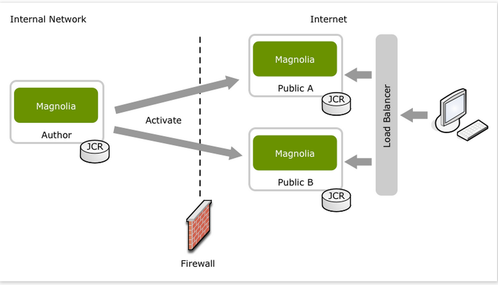
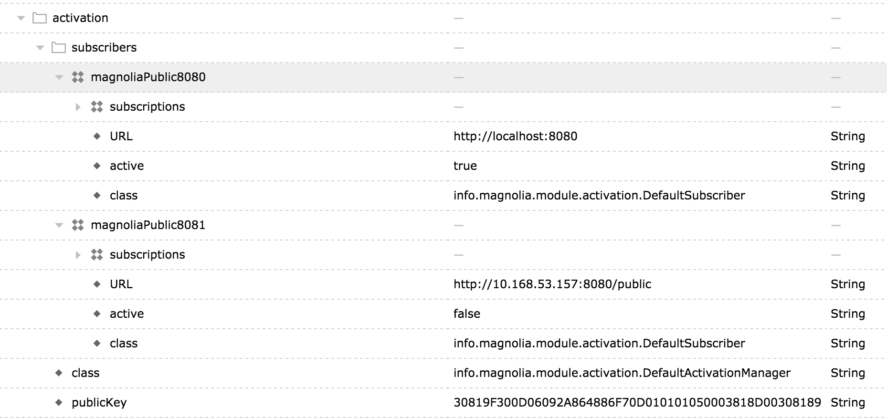

#CMS 部署

### 1. 部署
1. 拷贝生成好的软件包（/root/static.tar.gz, /root/author.tar.gz）到midas-jiashi-ansible/playbooks/roles/magnolia/files
2. 修改hosts 配置文件，将编辑机和发布机指向到相应的机器ip。
3. 修改部署成功，check 发布机的页面是否正常，如果不正常请参考发步骤二。
4. 切换Nginx，将所有/static 请求转发到发布机相应的机器和端口（默认的是9090端口）
5. 检查首页，及帮助中心是否正常（手动check一下）

### 2. 部署完配置

如何配置多台发布机器
为了解决单点故障所以我们的部署结构是下图所示的方式

这种部署结构会需要多台发布机器。具体的部署请在配置－》server－》activation配置发布机器的地址，编辑机器会将内容发布到配置中的发布机。magnoliaPublic8081种active为false，所以在发布的时候会忽略该发布机。

如果新加一个发布机，需要确保新建的发布机器页面和图片都是全的，如果页面或者资源不是全的，需要点击发布对资源进行发布。
比如直接访问：http://10.168.53.157:8080
首先将查看发布机器内容是否为全的。如果为全的，则直接切换nginx来使发布机器可用
如果补全，找到缺失内容，然后重新发布，然后再次切换nginx。

